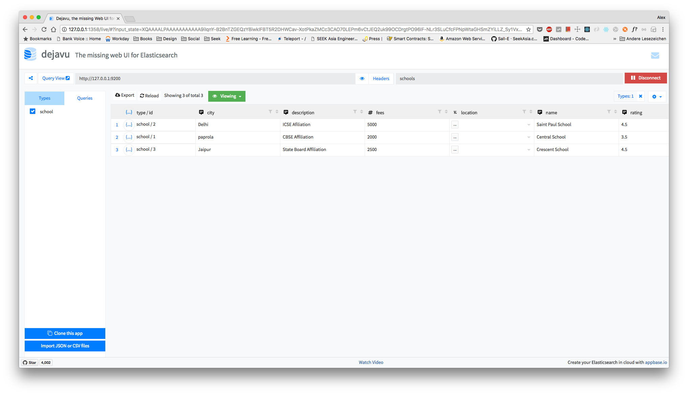
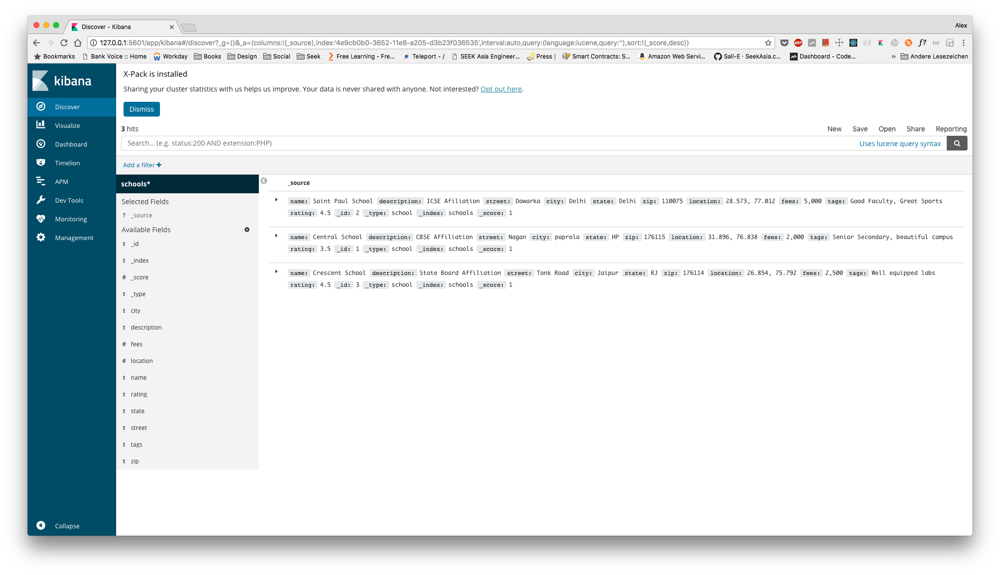
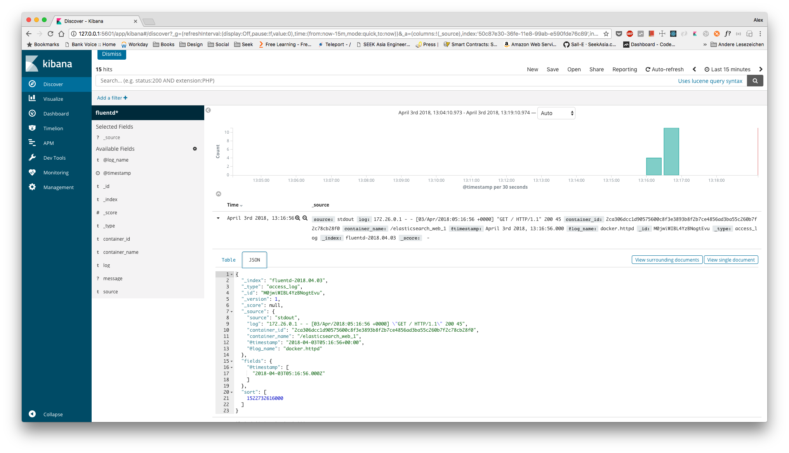

# ElasticSearch Docker

This repo demonstrates some usage of ElasticSearch in Docker.


## Start

```bash
$ docker-compose up -d
```

## Verify

```bash
$ docker-compose ps
```

Output:

```bash
            Name                           Command               State                         Ports
---------------------------------------------------------------------------------------------------------------------------
elasticsearch_elasticsearch_1   /usr/local/bin/docker-entr ...   Up      127.0.0.1:9200->9200/tcp, 127.0.0.1:9300->9300/tcp
```

## Check Health

```bash
$ curl localhost:9200/_cat/health
```

Output:

```
1522654718 07:38:38 docker-cluster green 1 1 1 1 0 0 0 0 - 100.0%
```

## UI

Enter the elasticsearch url `http://127.0.0.1:9200` at the following url:

```bash
$ open http://127.0.0.1:1358
```



## Create Index

```bash
$ curl -X PUT 127.0.0.1:9200/schools
```

Output:

```bash
{"acknowledged":true,"shards_acknowledged":true,"index":"schools"}
```

## Post Data

```bash
$ curl -XPOST -H "Content-Type:application/x-ndjson" --data-binary @data.json http://127.0.0.1:9200/schools/_bulk
```

Output:

```bash
{"took":168,"errors":false,"items":[{"index":{"_index":"schools","_type":"school","_id":"1","_version":1,"result":"created","_shards":{"total":2,"successful":1,"failed":0},"_seq_no":0,"_primary_term":1,"status":201}},{"index":{"_index":"schools","_type":"school","_id":"2","_version":1,"result":"created","_shards":{"total":2,"successful":1,"failed":0},"_seq_no":0,"_primary_term":1,"status":201}},{"index":{"_index":"schools","_type":"school","_id":"3","_version":1,"result":"created","_shards":{"total":2,"successful":1,"failed":0},"_seq_no":0,"_primary_term":1,"status":201}}]}
```

## Search

Search all:

```bash
$ curl -XPOST -H "Content-Type:application/json" -d '{}' http://127.0.0.1:9200/schools/_search
```

Output:

```bash
{"took":2,"timed_out":false,"_shards":{"total":5,"successful":5,"skipped":0,"failed":0},"hits":{"total":3,"max_score":1.0,"hits":[{"_index":"schools","_type":"school","_id":"2","_score":1.0,"_source":{"name":"Saint Paul School", "description":"ICSE Afiliation", "street":"Dawarka", "city":"Delhi", "state":"Delhi", "zip":"110075", "location":[28.5733056, 77.0122136], "fees":5000, "tags":["Good Faculty", "Great Sports"], "rating":"4.5"}},{"_index":"schools","_type":"school","_id":"1","_score":1.0,"_source":{"name":"Central School", "description":"CBSE Affiliation", "street":"Nagan","city":"paprola", "state":"HP", "zip":"176115", "location":[31.8955385, 76.8380405],"fees":2000, "tags":["Senior Secondary", "beautiful campus"], "rating":"3.5"}},{"_index":"schools","_type":"school","_id":"3","_score":1.0,"_source":{"name":"Crescent School", "description":"State Board Affiliation", "street":"Tonk Road", "city":"Jaipur", "state":"RJ", "zip":"176114","location":[26.8535922, 75.7923988],"fees":2500, "tags":["Well equipped labs"], "rating":"4.5"}}]}}
```

Search specific query:

```bash
$ curl -XPOST -H "Content-Type:application/json" -d @search.json http://127.0.0.1:9200/schools/_search
```

Output:

```bash
{"took":7,"timed_out":false,"_shards":{"total":5,"successful":5,"skipped":0,"failed":0},"hits":{"total":1,"max_score":0.2876821,"hits":[{"_index":"schools","_type":"school","_id":"1","_score":0.2876821,"_source":{"name":"Central School", "description":"CBSE Affiliation", "street":"Nagan","city":"paprola", "state":"HP", "zip":"176115", "location":[31.8955385, 76.8380405],"fees":2000, "tags":["Senior Secondary", "beautiful campus"], "rating":"3.5"}}]}}
```

## View Indices

```bash
$ curl http://127.0.0.1:9200/_cat/indices?v
```

## Kibana

Kibana is available at `http://127.0.0.1:5601`.



## Fluentd

```bash
$ docker pull ubuntu

$ docker run -t -i --log-driver=fluentd ubuntu echo "Hello Fluent Bit!"
$ docker run --rm --log-driver=fluentd ubuntu /bin/echo 'Hello world'
```

Trigger logs:

```bash
$ repeat 10 curl http://localhost:80/
```



## TODO

- Add example on how to sync data from mysql to elasticsearch
- Add example on how to sync data from elasticsearch to S3
- See how to use elasticsearch as complete logging tools for microservices
- See if it is possible to integrate grafana or prometheus
- Setup it in Kubernetes and Nomad environment
